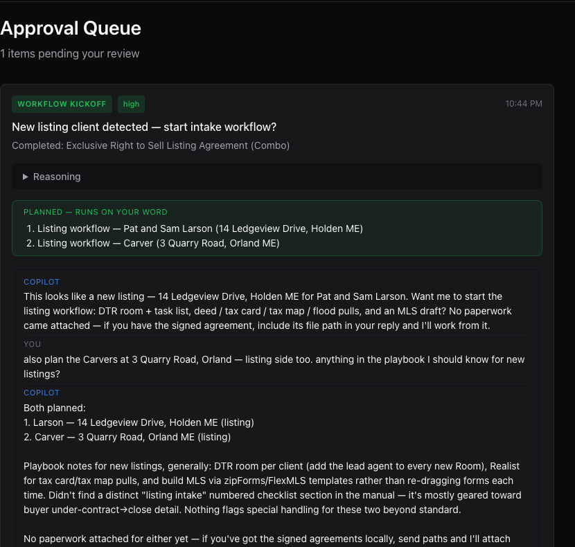
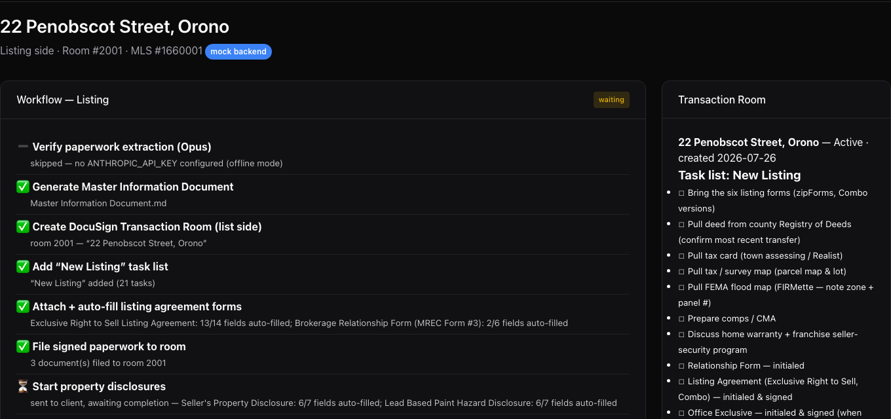

# RealtorAI

[](https://github.com/zeiglerbd5/realtorai/actions/workflows/ci.yml)

An AI transaction coordinator for a working Maine real-estate team.

I work as the transaction coordinator (TC) for a listing team at a Maine
brokerage. This project automates the TC workload — new-client intake →
DocuSign Transaction Room + task lists → auto-filled state forms → public
records (tax map, tax card, flood determination, recorded deed) → draft MLS
listing — under two constraints that shaped the whole design:

1. **The enterprise APIs are approval-locked.** DocuSign Rooms needs broker
   account approval; the Maine MLS (Flexmls/Spark) needs MLS approval. So the
   integrations are built against the real API surfaces with local simulators
   behind the same client interface — flipping two env vars is the entire
   live cutover.
2. **Nothing runs without a human.** The approval gate is architecture, not
   prompting: the AI agent has no execution tools, so "human in the loop"
   is a property the model cannot talk its way out of.

The AI components run on the Claude API with per-task model routing
(Sonnet 5 for high-volume structured work, Opus 4.8 for verification and
deed review) and were validated against real inbox traffic.

A transaction's paperwork never arrives all at once — the signed agreement
comes Tuesday, disclosures Friday, the seller's answers whenever. The
system is built for that: workflows wait without blocking, every new
document advances everything it touches immediately, and "what's still
missing" is always a current answer instead of an audit.

## Five-minute tour (no API keys required)

```bash
git clone https://github.com/zeiglerbd5/realtorai.git && cd realtorai
pip install -e ".[dev]"          # or: uv sync

pytest                           # 110 tests, fully offline, ~2 seconds
python scripts/demo_listing_workflow.py --fresh   # full intake on the reference listing
realtorai-web                    # → http://127.0.0.1:8421
```

Open the **Transactions** tab to browse the created room, task list, filled
forms, workflow timeline, and draft MLS listing — all on the mock backends.
With `ANTHROPIC_API_KEY` set, the chat copilot, intake classification,
extraction, and verification go live.

## The intake workflow

A realtor signs a new client and the paperwork lands in the monitored inbox;
the system proposes the intake and — once a human approves — runs it:

```
"Here's the new client's paperwork" (email + attachments)
    ↓
Classify intake (listing vs. buyer)          Claude Sonnet
    ↓
╔══ HUMAN APPROVAL GATE ═════════════════════════════════════╗
║  Proposal waits in the queue. The thread on the task is a  ║
║  tool-calling agent that scopes the work; a regex-matched  ║
║  go-word (or the Approve button) is the only trigger.      ║
╚════════════════════════════════════════════════════════════╝
    ↓
Extract Master Information Document          Claude Sonnet → TransactionRecord
    ↓
Verify extraction against source docs        Claude Opus (second-model audit)
    │    critical issues BLOCK the run — no room, no forms, no MLS draft
    │    on data that failed the audit; re-verifies on resume
    ↓
Create DocuSign Transaction Room (DTR)       field data auto-synced
    ├─ Add "New Listing" task list           from the team's real checklists
    ├─ Attach Maine forms                    auto-filled from room field data
    ├─ File signed paperwork into the room
    └─ Start property disclosures            waits on client, doesn't block
    ↓
Create draft MLS listing                     draft carries the 49-required-field
    │                                        publish-readiness report
    ↓
Pull tax map (parcel pin) · tax card · FEMA flood map     live, keyless
    ↓
Deed review — restrictions & rights of way   Claude Opus reads the scanned PDF
    ↓
Master doc updated with findings             internal only, never filed to DTR
```

Buyer clients get the same intake with a Buyer Agreement task list and no
MLS activity.

**Going under contract is a phase change, not a new deal.** When the signed
Purchase & Sale arrives (classified `under_contract`, matched to the
existing transaction by address), approval runs the next phase on the same
record: contract terms extracted from the P&S with a focused schema (so
listing-phase data can't be clobbered) and Opus-verified, the side's Under
Contract task list joins the room, the signed contract is filed, the
office's Transaction Worksheet is filled, the MLS listing moves to Pending,
and every contract deadline (EMD, inspection, financing commitment,
closing) lands on the dashboard as a dated item. Prior phases' timelines
are archived on the envelope, never overwritten.

**Closing completes the arc.** When the settlement statement arrives, the
closing phase reads it, cross-checks it against the record — final price
vs contract, negotiated concessions actually present, commission sanity —
and HOLDS for team review on any discrepancy (the office rule). Then: the
Closing task list joins the room, the statement is filed, the Transaction
Worksheet updates with final numbers, the MLS listing moves to Closed,
open deadlines resolve, the client is marked closed, and the room itself
closes with its closing date — the same end state as a real closed room.
The whole lifecycle, offline:

```bash
python scripts/demo_lifecycle.py    # listing -> under contract -> closed
```

## The approval gate is structural

Every agent demo claims "human in the loop." Here it is enforced by what the
model physically cannot call:

- The copilot on each queue task has **read tools** (transaction status, MLS
  readiness, playbook search, knowledge-base search with statute citations,
  intake documents) and **scoping tools**
  (`plan_workflow` queues work on the task; `attach_local_file` adds
  paperwork). **Execution tools do not exist.**
- Execution fires only on an explicit operator go — matched by a regex in
  plain code (`orchestration/conversation.py`), or the Approve button. A
  "no" rejects. The model never decides to run anything.
- The dashboard chat is the same agent without a task pinned; its only write
  tool files a *new proposal* into the queue, which faces the same gate.
- `tests/test_dashboard_copilot.py` asserts the no-execution-tools invariant;
  `tests/test_conversational_approval.py` proves propose/plan/reject run
  nothing and that a go-word runs one workflow per planned item.

A typical thread on a proposal (fictional data):

> **Copilot:** This looks like a new listing — 14 Ledgeview Drive for Pat &
> Sam Larson. Want me to start the listing workflow: DTR room + task list,
> deed / tax card / tax map / flood pulls, and an MLS draft?
>
> **TC:** also add the Carvers at 3 Quarry Road, and check the playbook for
> anything special on new listings
>
> **Copilot:** Both planned. Playbook says to add the lead agent to every new
> room — that's set on both. Say the word and I'll run both.
>
> **TC:** go ahead
>
> **System:** Done — ran 2 workflows: listing — Larson: waiting on
> disclosures; MLS 44/49 required fields ready …

The conversation *scopes*; the go-word *executes*; the system reports back.

An actual proposal in the queue (fictional demo data, live copilot):



## Validated on real traffic

The intake classifier was evaluated against the team's actual forwarded
inbox (signed-envelope notifications, prose handoffs, offers, counters,
earnest-money notices, staff broadcasts). The sweep surfaced a real recall
gap — an agent's prose handoff with no attachments ("rooms already started,
here are the two listings") classified as noise — the taxonomy was widened,
and the fix is locked in by a runnable eval with fictionalized cases:

```bash
python scripts/eval_intake_classifier.py    # 14/14, needs ANTHROPIC_API_KEY
```

## Paperwork filling: capture once, verify once, fill everywhere

The LLM never transcribes values into forms. Sonnet extracts the paperwork
into the canonical `TransactionRecord` once; Opus verifies it once; after
that every destination is a deterministic Python mapping — DocuSign room
field data (forms auto-fill in Rooms), the MLS payload, the master info
document, and the agency's fillable PDFs filled field-by-field with pypdf.
Deterministic fill means a price or deadline can never be hallucinated in
transit, and re-syncs are free.

Publish readiness is judged by `schemas/mls_required.py` — the 49 fields
Maine Listings requires, exactly, asserted by test, and the single source
of truth for MLS validation. A draft is allowed to be incomplete (that's
what drafts are for), but it carries its readiness report ("44/49 ready;
missing: …") into the workflow status, the master document, and the
copilot's answers — and can't be called publish-ready until 49/49.

## Automatic model selection

| Task | Tier | Default model |
|---|---|---|
| Chat copilot, intake classification, extraction, form fill, drafting | Standard | `claude-sonnet-5` |
| Extraction verification, deed review | Review | `claude-opus-4-8` |

Configured via `CLAUDE_MODEL_STANDARD` / `CLAUDE_MODEL_REVIEW`
(`inference/model_router.py`). Without an `ANTHROPIC_API_KEY`, LLM steps
skip with a note and everything else — workflows, mocks, UI, tests — runs.

## Mock backends behind the live client interfaces

| Setting | `mock` (default) | `live` |
|---|---|---|
| `DOCUSIGN_BACKEND` | JSON-backed Rooms simulator seeded with Maine forms + the team's real task-list templates | Rooms API v2 |
| `MLS_BACKEND` | Local draft-listing store | Spark API |

Every workflow, test, and UI page runs identically on both; the simulators
implement the documented API shapes (Rooms v2, Spark `POST /listings`).

The reference listing after intake — workflow timeline, per-form auto-fill
coverage, and the room with the team's real task-list template:



## Public records: live, keyless, cross-checked

No approvals needed here — `PUBLIC_RECORDS_LIVE` controls it, falling back
to manual pull sheets on any failure:

- **Flood** — Census geocoder → FEMA National Flood Hazard Layer → USGS topo
  basemap: flood zone, SFHA flag, FIRM panel, and a pinned map composite in
  ~3s. `python scripts/flood_lookup.py "22 Penobscot St, Orono, ME"`
- **Tax map** — Maine GeoLibrary statewide parcel layer; parcel found by
  address (buffered point query fallback), boundaries rendered with the
  subject lot highlighted, and the state Map/Block/Lot cross-checked against
  the record.
- **Tax card** — Vision Government Solutions (VGSI), the assessment platform
  most Maine towns publish through. The ASP.NET site hides a JSON search
  service; two HTTP requests replace a browser session. Every card field is
  cross-checked against the record with flags on mismatches.
- **Recorded deeds** — the county registry (Browntech ALIS) turns out to be
  fully driveable with plain GETs: book/page search → grantor/grantee index
  → free-view PDF of the recorded deed. Opus then reads the scan directly
  (no OCR) and flags restrictions, rights of way, and chain-of-title issues.
  `python scripts/deed_lookup.py penobscot 16601 156 --review`

Each fetched value can **fill** an empty record field but never overwrite an
extracted one — conflicts get flagged for the human instead.

## Architecture

```
Monitored inbox (agency mail forwarded to a dedicated account)
    ↓  daily reader task calls scripts/propose_intake.py
Intake classifier (Sonnet)  →  WORKFLOW_KICKOFF proposal in the queue
    ↓  conversational scoping (tool-calling copilot)
    ↓  operator go-word / Approve            ← the structural gate
Workflow engine (resumable steps, waiting-on-client states)
    ├─ DocuSign Rooms client  (mock | live)
    ├─ MLS client             (mock | live)
    ├─ Public-records fetchers (live, keyless)
    └─ Deterministic form fillers (pypdf)
    ↓
Execution results narrated back into the task thread
```

Key components:

- **Claude engine** (`inference/claude_engine.py`) — async SDK wrapper:
  structured outputs via `messages.parse`, raw tool-calling turns for the
  agent loop, PDF document input for deed review, task-based model routing.
- **Copilot** (`orchestration/copilot.py`) — one agent core, two modes
  (queue-task thread / dashboard chat) with mode-specific tool registries.
- **Conversation gate** (`orchestration/conversation.py`) — go/no-go in
  plain code; file paths in a reply are attached before execution, and a
  missing path blocks the run.
- **Workflow engine** (`workflows/`) — resumable step pipeline; a step can
  wait on the client without blocking the rest.
- **Approval queue** (`orchestration/`) — SQLite-backed proposals with an
  audit trail; every decision is logged as feedback for future fine-tuning.
- **Optional local fallback** — a few structured helpers can run on an MLX
  model when no API key is configured (`pip install -e ".[local]"`,
  Apple Silicon only). The copilot and workflows are Claude-native.

## Project structure

```
src/realtorai/
├── agents/          # Email triage agents
├── config/          # Pydantic settings (env-driven)
├── documents/       # Master info doc + deterministic PDF form fillers
├── inference/       # Claude engine, model router, extraction; MLX fallback
├── integrations/    # docusign/ (Rooms v2 + mock), spark/ (MLS + mock),
│                    # graph/ (Outlook), fema_flood, maine_parcels,
│                    # vgsi_tax_card, registry/ (county deeds)
├── orchestration/   # queue, approval loop, copilot agent, conversation gate
├── rag/             # ChromaDB knowledge base (statutes, rules, NAR ethics,
│                    # playbook; section-aware chunks -> citeable legal answers)
├── schemas/         # TransactionRecord, MLS 49-field gate, tasks
├── storage/         # SQLite (aiosqlite), transaction envelopes, Keychain
├── workflows/       # engine, listing/buyer intake, enrichment, email trigger
└── ui/              # FastAPI + Jinja2 + HTMX dashboard
```

## Development

```bash
pytest                  # offline suite (mock backends, no keys)
ruff check .            # lint
```

CI runs ruff and the suite on every push (`.github/workflows/ci.yml`) —
on Linux, which works because the offline suite has no Apple-only
dependencies. The lint gate is clean: zero findings, no suppressions
beyond one documented convention.

## Privacy

All data lives on local disk (SQLite + JSON envelopes under `data/`, which
is gitignored). OAuth tokens go to the macOS Keychain. With an API key
configured, LLM calls go to the Anthropic API; nothing else leaves the
machine. This public repository is fully anonymized — no client names,
agent identities, or agency-internal forms.

## Status & roadmap

Working today (on mock backends where noted): the full transaction
lifecycle — listing + buyer intake, the under-contract phase (P&S
extraction, UC/EMD task lists, Transaction Worksheet, MLS to Pending,
deadline tracking), and the closing phase (settlement-statement review
with discrepancy holds, room close-out) — plus the conversational
approval queue, dashboard copilot, live public records for
Penobscot-county properties, deterministic form filling, MLS readiness
reporting, email-intake proposals, and a 110-test offline suite.

Next: live Rooms/Spark cutover when broker + MLS approval lands; more
county registry adapters (Hancock/AcclaimWeb, Waldo); calendar actions;
LoRA fine-tuning on the accumulated approval feedback.

See [PROGRESS.md](PROGRESS.md) for the detailed tracker.

## License

All rights reserved. This source is published for portfolio review and
evaluation only — no use, copying, modification, or redistribution is
permitted without written permission. See [LICENSE](LICENSE).
